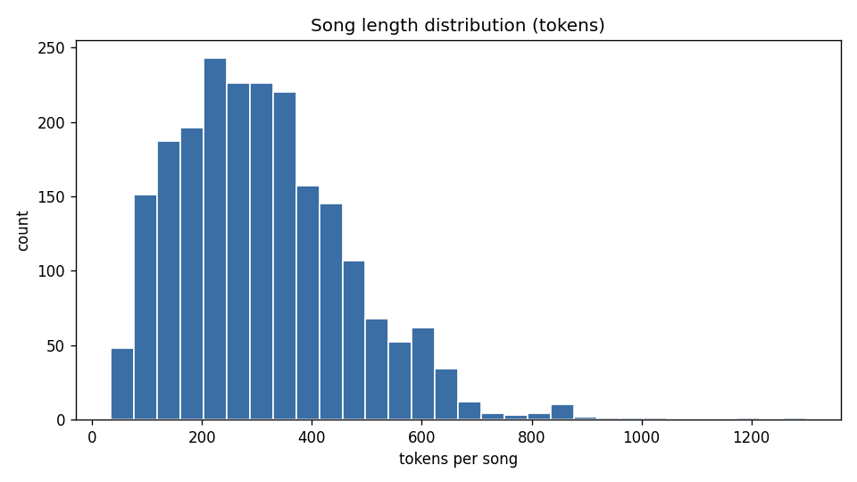
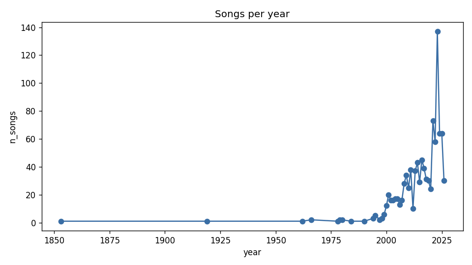
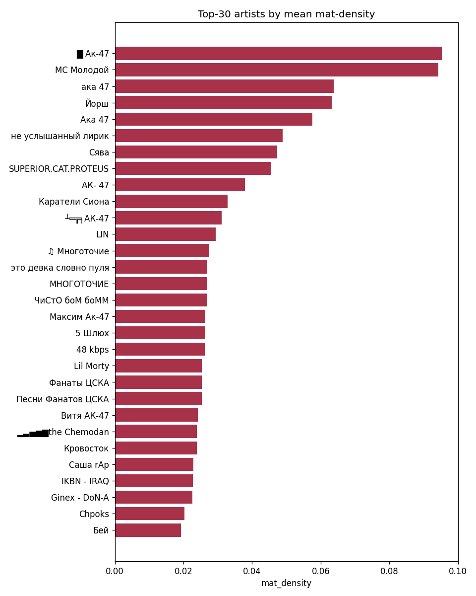
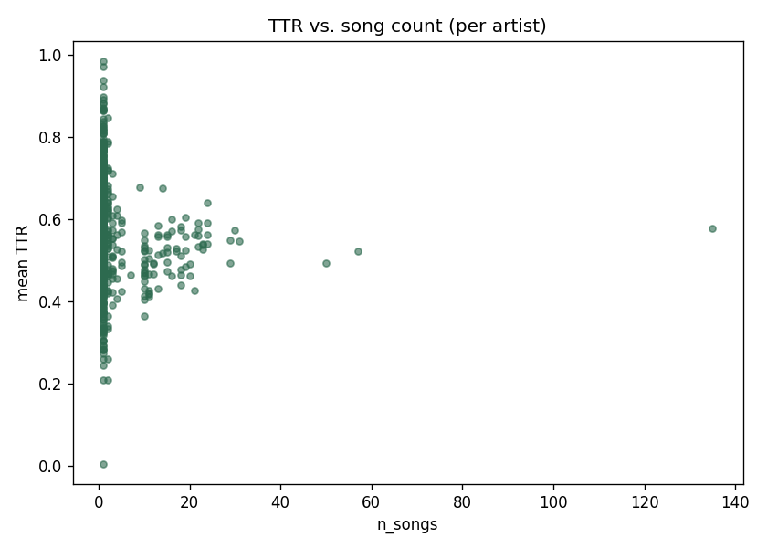
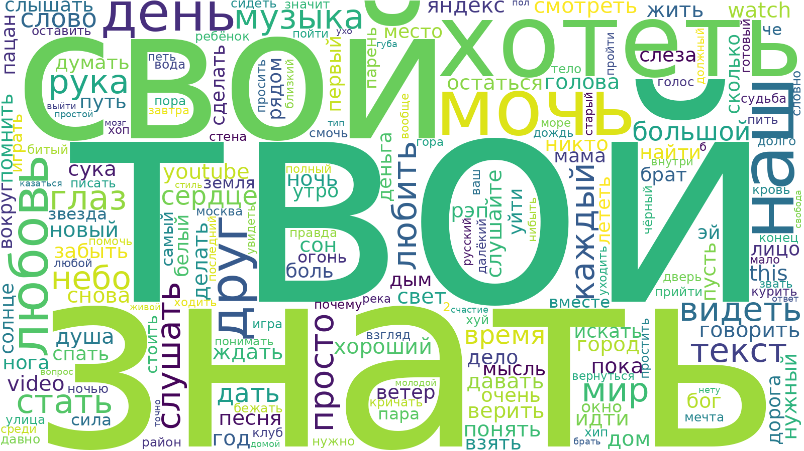
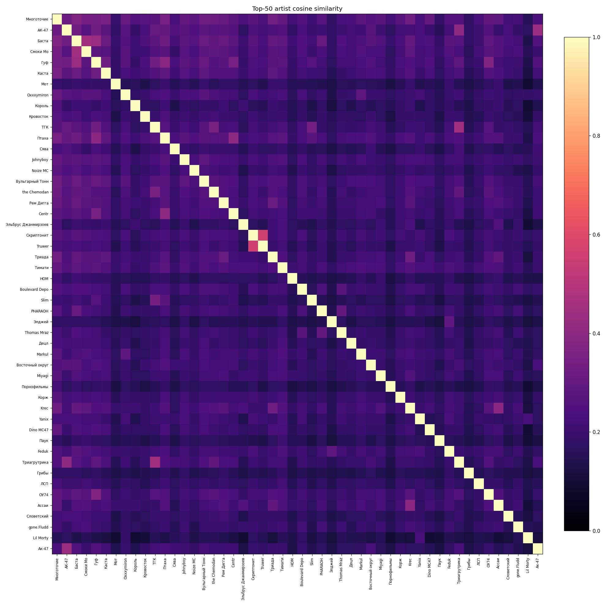

# Русский хип-хоп: ML-анализ текстов

**Дата генерации:** 2026-05-25  
**Объём корпуса:** 2,162 трека / 648 артистов / 1853–2026  
**Токенов:** 671,923

## Корпус статистика

- [corpus_overview.csv](static/stats/corpus_overview.csv) — aggregate по корпусу
- [artists.csv](static/stats/artists.csv) — по артистам (count, TTR, mat, emotions)
- [by_year.csv](static/stats/by_year.csv) — по годам
- 
- 
- 
- 

## Wordcloud

  
[Top terms](static/wordcloud/global_top_terms.csv) (CSV)

## Сходство артистов (TF-IDF cosine)

- [nearest_neighbors.csv](static/similarity/nearest_neighbors.csv)
- [artist_cosine.csv.gz](static/similarity/artist_cosine.csv.gz) (полная матрица)
- 

## Темы (LDA)

- [topics_top_terms.csv](static/topics/topics_top_terms.csv)
- [doc_topic.csv](static/topics/doc_topic.csv) (треки → темы)
- [artist_topic.csv](static/topics/artist_topic.csv) (артисты → темы)
- [coherence_summary.csv](static/topics/coherence_summary.csv)

## Графы

- [Коллаборации (interactive)](static/graph/collab.html)
- [Сходство (interactive)](static/graph/similarity.html)
- [Коллабы GEXF](static/graph/collab_full.gexf) / [Communities](static/graph/collab_communities.csv)
- [Сходство GEXF](static/graph/similarity_full.gexf) / [Communities](static/graph/similarity_communities.csv)

## Нормализованный корпус

- [normalized.jsonl](normalized.jsonl) — все треки с text_clean, токенами, леммами, фичами
